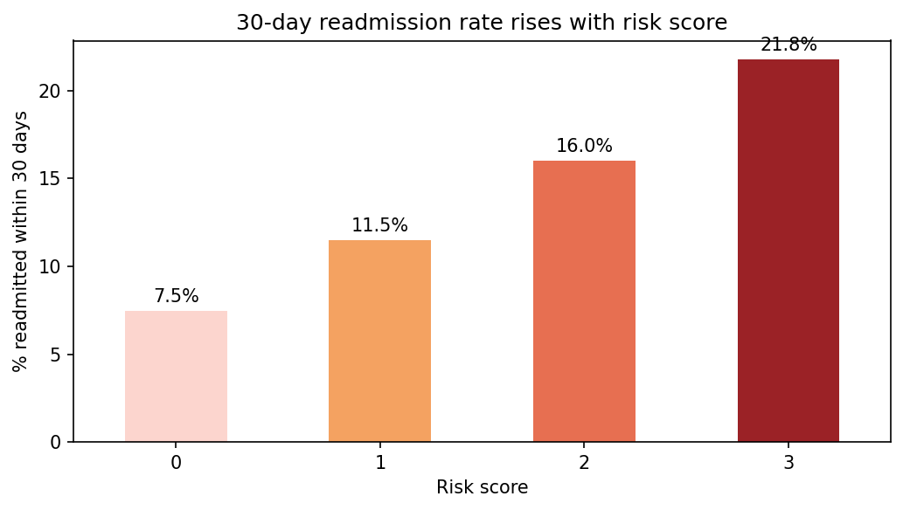

# Diabetes 30-Day Readmission Risk Screening

An explainable, SQL-based risk score that flags diabetic patients at higher risk of hospital readmission within 30 days.

**Tools:** Python · SQL (SQLite) · pandas · matplotlib

---

## The problem

Hospital readmissions within 30 days are costly and often preventable, and hospitals face financial penalties under CMS rules for high readmission rates. This project asks: **can a patient's visit history and basic encounter data flag who's at higher risk of returning within 30 days, before they're discharged?**

## The data

[Diabetes 130-US Hospitals for Years 1999-2008](https://www.kaggle.com/datasets/brandao/diabetes) (Kaggle / UCI). A single file, `diabetic_data.csv`:

- **101,766 hospital encounters** for diabetic patients across 130 US hospitals, 1999–2008
- 50 columns, including prior visit counts, length of stay, medications, diagnoses, and the outcome column `readmitted` (NO / <30 / >30)

The raw data is not included in this repository. Download it from Kaggle (link above) and place `diabetic_data.csv` in a `data/` folder.

---

## Approach

1. **Cleaned the data.** Removed 2,423 encounters where the patient died or was discharged to hospice during the stay — a patient who died cannot be readmitted, and leaving these in would understate the true readmission rate. 99,343 encounters remained.
2. **Compared** patients readmitted within 30 days against everyone else on six candidate signals: prior inpatient visits, prior ER visits, prior outpatient visits, length of stay, medication count, and number of diagnoses.
3. **Kept the three strongest signals** and built a points-based risk score from them.
4. **Checked the score** against the actual readmission outcomes.
5. **Produced a flagged list** of high-risk encounters with the evidence behind each flag.

## Findings

| Signal | Not readmitted in 30 days | Readmitted in 30 days | Used in score? |
|---|---|---|---|
| Avg prior inpatient visits | 0.55 | 1.22 | Yes |
| Avg prior ER visits | 0.18 | 0.36 | Yes |
| Avg number of diagnoses | 7.36 | 7.69 | Yes (weaker signal) |
| Avg prior outpatient visits | 0.36 | 0.44 | No, difference too small |
| Avg length of stay | 4.33 days | 4.77 days | No, difference too small |
| Avg number of medications | 15.86 | 16.91 | No, difference too small |

Prior inpatient visits, checked by bucket, show a clean rising pattern: 0 prior admissions → 8.6% readmitted, 1 → 13.3%, 2+ → **22.0%**.

## The risk score

One point for each of the following, for a score of 0 to 3:

- **Prior inpatient admission:** any hospitalization in the year before this encounter
- **Prior ER visit:** any emergency visit in the year before this encounter
- **High diagnosis count:** 9 or more diagnoses on record

No minimum-sample adjustment was needed here (unlike the companion fraud-screening project), since each signal is a simple count on a single encounter rather than an average across many records.

## Results

Readmission rate rises steadily with the score:

| Risk score | Encounters | % readmitted within 30 days |
|---|---|---|
| 0 | 34,981 | 7.5% |
| 1 | 40,826 | 11.5% |
| 2 | 19,323 | 16.0% |
| 3 | 4,213 | **21.8%** |



**Flagging encounters scoring 2 or higher** (23,536 encounters, 23.7% of all encounters):

- **Precision:** 17.0% (4,009 of 23,536 flagged encounters are readmitted, vs. an 11.4% base rate)
- **Recall:** 35.4% of all 30-day readmissions are caught
- **Lift:** 1.5x over random selection

**Honest context on this lift:** 1.5x is far more modest than the 6.3x lift achieved in the companion Medicare fraud-screening project, and that's expected rather than a flaw. Predicting readmission from basic visit counts is a genuinely harder problem than spotting billing outliers — a patient's health trajectory depends on many factors this dataset doesn't capture (social support, medication adherence, severity of illness). Published readmission research using similarly simple rule-based approaches reports comparably modest lift.

The full list of flagged encounters, with the reason behind each flag, is in `outputs/high_risk_encounters.csv`.

## Limitations

- **A screening tool, not a diagnosis.** A flagged encounter means "worth extra discharge planning attention," not "will definitely be readmitted."
- **Low recall.** The score misses 65% of actual 30-day readmissions — many readmitted patients don't stand out on these three measures.
- **Encounters, not unique patients.** The same patient can appear more than once (101,766 encounters, 71,518 unique patients). This measures per-visit risk, which is also how hospitals are evaluated under CMS readmission penalties.
- **One specific population and era.** This data covers only diabetic patients, from 1999–2008; patterns may not generalize to other conditions or more recent care practices.
- **Tuned and tested on the same data.** A real deployment should validate the scoring rules on separate, unseen data.

## Reproduce it

1. Download `diabetic_data.csv` from Kaggle into `data/`.
2. Install dependencies: `pip install pandas matplotlib` (SQLite ships with Python).
3. Open `readmission_notebook.ipynb` and run the cells top to bottom.

## Repository structure

````
.
├── README.md
├── readmission_notebook.ipynb   # full analysis: cleaning, SQL, scoring, chart
├── outputs/
│   └── high_risk_encounters.csv # 23,536 flagged encounters, ranked by score
├── images/
│   └── readmit_rate_by_score.png
└── data/                         # not included; see "The data"
````

---

**Related project:** [Medicare Provider Risk Screening](https://github.com/your-username/medicare-provider-risk-screening) — a companion project applying the same explainable-scoring approach to identify potentially fraudulent Medicare providers.

**Author:** Terhas Gebreyohannes · 
[LinkedIn](https://www.linkedin.com/in/terhas-tekleslassie)

